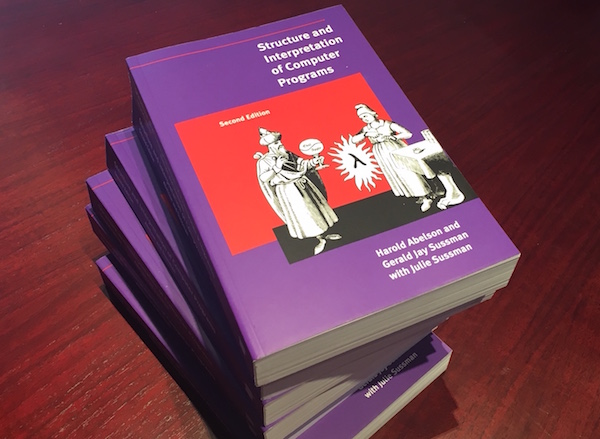

# Structure and Interpretation of Computer Programs (SICP) by Harold Abelson 

This repository contains notes from the book Structure and Interpretation of Computer Programs (SICP) by Harold Abelson, which is also known as the "Wizard Book" in Hacker circles.

Computational processes are abstract beings that inhabit computers. As they evolve, processes manipulate other abstract things called data. The evolution of a process is directed by a pattern of rules called a program. People create programs to direct processes. In effect, we conjure the spirits of the computer with our spells.We need an appropriate language for describing processes, and we will use for this purpose the programming language Lisp. Just as our everyday thoughts are usually expressed in our natural language (such as English, French, or Japanese), and descriptions of quantitative phenomena are expressed with mathematical notations, our procedural thoughts will be expressed in Lisp. Lisp was invented in the late 1950s as a formalism for reasoning about the use of certain kinds of logical expressions, called recursion equations, as a model for computation.

If Lisp is not a mainstream language, why are we using it as the framework for our discussion of programming? Because the language possesses unique features that make it an excellent medium for studying important programming constructs and data structures and for relating them to the linguistic features that support them. The most significant of these features is the fact that Lisp descriptions of processes, called procedures, can themselves be represented and manipulated as Lisp data. The importance of this is that there are powerful program-design techniques that rely on the ability to blur the traditional distinction between “passive” data and “active” processes. The ability to represent procedures as data also makes Lisp an excellent language for writing programs that must manipulate other programs as data, such as the interpreters and compilers that support computer languages.

# Downloading and setting up our Lisp Interpreter

The dialect of Lisp used in this book is called Scheme. You should not use Common Lisp if you want to have a good experience with SICP. To download and setup Scheme, follow these instuctions:

* Visit the [MIT/GNU website](https://www.gnu.org/software/mit-scheme/) and download the binary depending on which architecture your system uses (32 bit or 64 bit). At the time of this writing, the latest stable release is 10.1.11

* Install the Binary and allow macOS to run application from unidentified developers

* Open terminal and type the following command:

		sudo ln -s /Applications/MIT\:GNU\ Scheme\ 10.1.11.app/Contents/Resources /usr/local/lib/mit-scheme-x86-64

* Then enter your administrator password and run this command

		sudo ln -s /usr/local/lib/mit-scheme-x86-64/mit-scheme /usr/local/bin/scheme

# Important links

[MIT/GNU Scheme](https://www.gnu.org/software/mit-scheme/)

[Can I use Common Lisp for SICP?](https://stackoverflow.com/questions/1159208/can-i-use-common-lisp-for-sicp-or-is-scheme-the-only-option)

[How to install mit-scheme on Mac](https://stackoverflow.com/questions/12322434/how-to-install-mit-scheme-on-mac)

